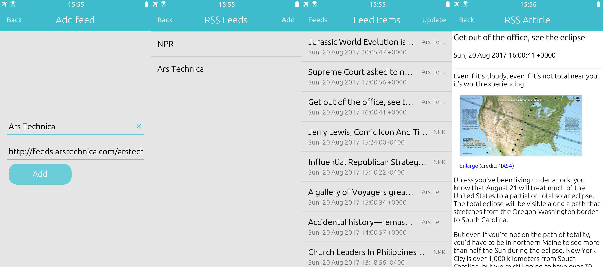

# Breeze

## Description

RSS and Atom reader for Tizen 2.4 mobile and up.

Tested on Samsung Z1,Z2,Z3,Z4.



## Compiling

### For Tizen

Install Tizen Studio including the CLI tools and setup the certificate you want
to use to sign the tpk.
Save the name of the certificate to your environment:

```bash
export TIZEN_CERTIFICATE=<certificate_name>
```


The path to Tizen Studio, choise of architechture and compiler can be set in
the file `build_opt.sh`

Then compile with
```bash
./build_all.sh
```
The tpk will be placed in the folder `Release`

Install the tpk on your device using:

```bash
sdb install <tpk file>
```

### For Linux

```bash
./autogen.h
./configure
make
```

## Licence

GPL Version 3

See `COPYING` for details
